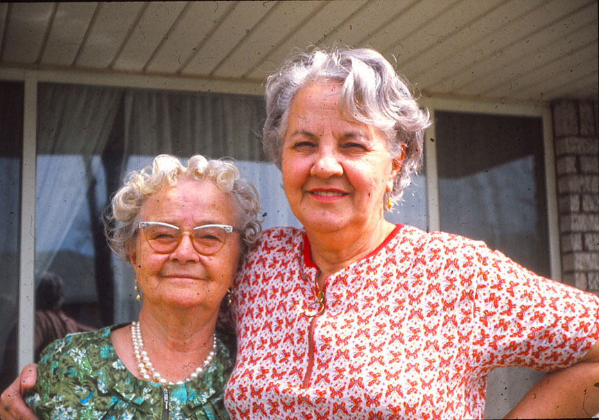

Bieszczady Mountains

# Katarzyna and Ignacy Szewczyk

Pronounced: Chef Shick  

Grandparents of Gwen, Vivian, Jonathan and Robert.  

Great-great grand daughter Abbey's DNA test confirmed that the couple were from communities along the Ukrainian-Polish boarder. Abbey's results showed that our ancestors were from [Podkarpackie Voivodeship](https://www.google.com/maps/place/Podkarpackie+Voivodeship,+Poland/@50.64952,15.5016628,5.62z/data=!4m5!3m4!1s0x473c8befdba361b5:0x1017cadc5e4c0a0!8m2!3d50.0574749!4d22.0895691) and across the border in [Ternopil Oblast](https://www.google.com/maps/place/Ternopil+Oblast,+Ukraine/@43.3835873,3.242089,4z/data=!4m5!3m4!1s0x47304b5bd69ed265:0x101068488f64050!8m2!3d49.553517!4d25.594767) by the Bieszczady Mountains (above). 

Ignacy and Katarzyna spent a short time farming in Massachusetts before settling in Detroit, Michigan. Ignacy worked for the Michigan Central Railroad<!--, not the Père Marquette Railroad-->. He then worked at Ford before owning a Gulf gas station in Centerline, Michigan.  Polish immigrants migrated to the “Pioneer Valley” of Massachusetts as one of the best farmlands in America. Hamtramck Michigan in Detroit also had a large Polish community.

Katarzyna and Ignacy received their marriage license from a courthouse in Northampton, Massachusetts<!--According to Rob, was previously Springfield-->.  Ignacy indicated he was married in his 1909 ship records, so he and Katarzyna may have been married in Europe prior to her departure for America in 1903 at the age of 17.  

Katarzyna worked as a housekeeper at a Catholic church in Northampton, Massachusetts. When two priests arrived late one evening with women, Katarzyna and another housekeeper hid in a broom closet and witnessed inappropriate behavior in the kitchen. Katarzyna and Ignacy later became Latter Day Saints, and subsequently didn't celebrate Christmas, though their son-in-law Eugene set up a tree each year (with an electric train) in the house they shared in Detroit.  

Records from the Ellis Island website:

## Katarzyna Pron
Ethnicity: Galicy, Routhenian  
Place of Residence: Przyhajcze  
Date of Arrival: 20 May 1903  
Age on Arrival: 17y  
Gender: F  
Marital Status: S  
Ship Name: Barbarossa  
Port of Departure: Bremen, Germany  

Born: 1886 (estimate)  
Died: 1974 

Daughter Virginia Macks remembers hearing mention of the area named Galicy. She also remembers hearing the province/area of Przyhajcze, but we have yet to identify the current location of Przyhajcze.

Map: Kanczuga, Poland

  

## Ignacy Szewczyk
Ethnicity: Austrian, Polish  
Place of Residence: Kanczuga, Galicy  
Date of Arrival: 27 Apr 1909  
Age on Arrival: 27y  
Gender: M  
Marital Status: M  
Ship Name: Kaiser Wilhelm II  
Port of Departure: Bremen, Germany  

Born: 1882 (estimate)  
Died: Sept 1973  

Kanczuga is in modern day Poland, about seven miles west
from the Ukraine and twelve miles north of Slovakia.  

Katarzyna always mentioned Lancut which is about 1.5 miles northwest of Kanczuga. She may have been born there.

Ignacy had a book about Lezajsk which is about 2.5 miles north of Kanczuga. He may have come from Lezajsk. We called him Jaju Szewczyk (the Polish name for grandfather, which we pronounced JahJew).

Katarzyna passed away in 1974. Her funeral was during a tremendous snowstorm.  
Ignacy passed away early September 1973, just weeks before his grandson's wedding Sept. 22, 1973. 

Katarzyna and her daughter Virginia at their Virginia Park home 1973-74.
Katarzyna and Ignacy lived with their Virginia and Eugene [Macks](../macks) in a single level duplex.    

[Edit on GitHub](https://github.com/FamilyTreesNet/szewczyk)
