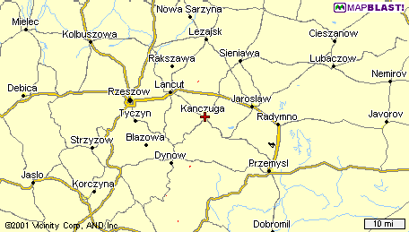

# Katarzyna and Ignacy Szewczyk

Pronounced: Chef Shick  

Grandparents of Gwen, Vivian, Jonathan and Robert  

Katarzyna and Ignacy received their marriage license from a courthouse in Springfield, Massachusetts.  Its possibile Ignacy and Katarzyna were married in Europe prior to 1909. (Note that Ignacy indicated he was married in the ship records.)  

Apparently Katarzyna arrived in the US six years before Ignacy. While living in Massachusetts, Katarzyna was a housekeeper at a Catholic Church, where she and another housekeeper hid in a broom closet and witnessed two priests coming in late and conducting inappropriate behavior with young women in the kitchen.  

Ignacy and Katarzyna spent a short time farming in Alabama before settling in Detroit, Michigan. Ignacy worked for the Michigan Central Railroad, not the Père Marquette Railroad. He then worked at Ford before owning a Gulf Gas Station in Centerline, Michigan.  

Records from the Ellis Island website:

## Katarzyna Pron
Ethnicity: Galicy, Routhenian  
Place of Residence: Przyhajcze  
Date of Arrival: 20 May 1903  
Age on Arrival: 17y  
Gender: F  
Marital Status: S  
Ship Name: Barbarossa  
Port of Departure: Bremen, Germany  

Born: 1886 (estimate)  
Died: 1974 

Daughter Virginia Macks remembers hearing mention of the area named Galicy. She also remembers hearing the province/area of Przyhajcze, but we have yet to identify the current location of Przyhajcze.

Map: Kanczuga, Poland

  

## Ignacy Szewczyk
Ethnicity: Austrian, Polish  
Place of Residence: Kanczuga, Galicy  
Date of Arrival: 27 Apr 1909  
Age on Arrival: 27y  
Gender: M  
Marital Status: M  
Ship Name: Kaiser Wilhelm II  
Port of Departure: Bremen, Germany  

Born: 1882 (estimate)  
Died: Sept 1973  

Kanczuga is in modern day Poland, about seven miles west
from the Ukraine and twelve miles north of Slovakia.  

Katarzyna always mentioned Lancut which is about 1.5 miles northwest of Kanczuga. She may have been born there.

Ignacy had a book about Lezajsk which is about 2.5 miles north of Kanczuga. He may have come from Lezajsk.

Katarzyna passed away in 1974. Her funeral was during a tremendous snowstorm.  
Ignacy passed away early September 1973, just weeks before his grandson's wedding Sept. 22, 1973. 

